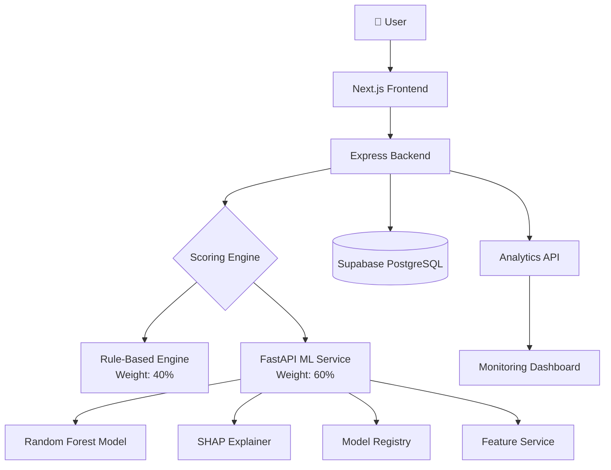
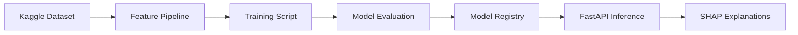
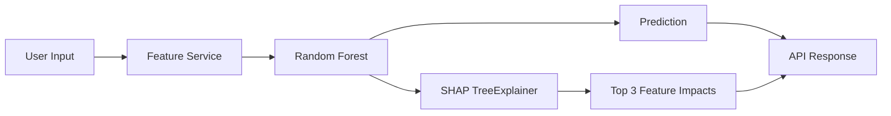

<p align="center">
  <h1 align="center">AltCred</h1>
  <p align="center">
    <strong>AI-Powered Alternative Credit Scoring Platform</strong>
  </p>
  <p align="center">
    <em>Hybrid ML + Rule-Based scoring · Explainable AI (SHAP) · Dockerized Microservices</em>
  </p>
</p>

<p align="center">
  
  
  
  
  
  
</p>

---

## Overview

**AltCred** is a production-grade fintech platform that uses machine learning to generate credit scores for individuals with little to no traditional credit history. It analyzes alternative data points — employment stability, income patterns, financial discipline — and combines a **rule-based engine** with a **Random Forest ML model** using a hybrid scoring architecture.

Every prediction is accompanied by **SHAP-based explanations**, telling users *why* they received their score.

---

## Architecture



### ML Pipeline



---

## Features

| Feature | Description |
|---|---|
| 🧠 **Hybrid Scoring** | Combines rule-based (40%) and ML-based (60%) scoring for robust predictions |
| 🔍 **Explainable AI** | SHAP integration returns top 3 feature impacts per prediction |
| 📦 **Model Registry** | Version-controlled model management with hot-swapping support |
| 🔄 **Feature Service** | Centralized preprocessing eliminates training-serving skew |
| 📊 **Monitoring Dashboard** | Real-time analytics for latency, risk distribution, and model health |
| 🐳 **Dockerized** | Full-stack containerization with health checks and volume mounts |
| 🛡️ **Graceful Fallback** | If ML service is down, system defaults to rule-based scoring (100%) |
| 🔐 **Secure Auth** | JWT-based authentication with bcrypt password hashing |

---

## Tech Stack

| Layer | Technology |
|---|---|
| **Frontend** | Next.js, React, Tailwind CSS, Recharts, Framer Motion |
| **Backend** | Node.js, Express.js, Axios |
| **ML Service** | Python, FastAPI, scikit-learn, SHAP, Pydantic |
| **Database** | Supabase (PostgreSQL) |
| **Infrastructure** | Docker, Docker Compose |
| **Auth** | JWT, bcrypt, Helmet, CORS |

---

## Getting Started

### Prerequisites

- Node.js 18+
- Python 3.11+
- Docker & Docker Compose (for containerized setup)
- A [Supabase](https://supabase.com) project

### 1. Clone the Repository

```bash
git clone https://github.com/Archisman-NC/AltCred.git
cd AltCred
```

### 2. Environment Variables

Copy the example file and fill in your credentials:

```bash
cp .env.example backend/.env
```

Create `frontend/.env.local`:

```env
NEXT_PUBLIC_API_URL=http://localhost:5000/api/v1
```

### 3. Manual Setup

```bash
# Backend
cd backend && npm install && npm run dev

# Frontend (new terminal)
cd frontend && npm install && npm run dev

# ML Service (new terminal)
cd ml && pip install -r requirements.txt
uvicorn ml.inference.app:app --host 0.0.0.0 --port 8000
```

---

## Running with Docker

The entire platform can be started with a single command:

```bash
make run
```

Or directly:

```bash
docker-compose up --build
```

| Service | Port | URL |
|---|---|---|
| Frontend | 3000 | `http://localhost:3000` |
| Backend | 5000 | `http://localhost:5000` |
| ML Service | 8000 | `http://localhost:8000` |

The backend automatically waits for the ML service to be healthy before starting.

---

## API Endpoints

### Backend (Express)

| Method | Endpoint | Description |
|---|---|---|
| `POST` | `/api/v1/auth/signup` | Register a new user |
| `POST` | `/api/v1/auth/login` | Authenticate user |
| `POST` | `/api/v1/intake/submit` | Submit financial assessment |
| `GET` | `/api/v1/analytics/predictions-summary` | Prediction statistics |
| `GET` | `/api/v1/analytics/risk-distribution` | Risk category breakdown |
| `GET` | `/api/v1/analytics/model-performance` | Model accuracy metrics |
| `GET` | `/api/v1/analytics/system-health` | System health status |

### ML Service (FastAPI)

| Method | Endpoint | Description |
|---|---|---|
| `GET` | `/health` | Service health check |
| `POST` | `/predict-credit-score` | Generate ML prediction |
| `POST` | `/reload-model` | Hot-reload active model |

#### Example Prediction Request

```bash
curl -X POST http://localhost:8000/predict-credit-score \
  -H "Content-Type: application/json" \
  -d '{
    "age": 28,
    "annual_income": 65000,
    "monthly_inhand_salary": 5200,
    "num_bank_accounts": 2,
    "num_credit_card": 1,
    "interest_rate": 8.5,
    "num_of_delayed_payment": 0,
    "outstanding_debt": 2500,
    "credit_utilization_ratio": 15.5,
    "total_emi_per_month": 450,
    "monthly_balance": 2200,
    "occupation": "Software Engineer",
    "credit_mix": "Good",
    "payment_of_min_amount": "Yes",
    "payment_behaviour": "Low_spent_Small_value_payments"
  }'
```

#### Example Response

```json
{
  "credit_score_category": "Good",
  "confidence": 0.87,
  "model_version": "credit_model_v1",
  "explanation": [
    {"feature": "outstanding_debt", "impact": -0.18},
    {"feature": "annual_income", "impact": 0.15},
    {"feature": "num_of_delayed_payment", "impact": -0.12}
  ],
  "latency_ms": 34.2
}
```

---

## Explainability (SHAP)

Every prediction includes a **SHAP-based explanation** showing the top 3 features that influenced the score.



This enables transparency and regulatory compliance for credit scoring decisions.

---

## Model Architecture

- **Algorithm**: Random Forest Classifier (100 estimators)
- **Accuracy**: ~78.3% (3-class classification)
- **Target**: `Credit_Score` → Poor (0), Standard (1), Good (2)
- **Features**: 15 financial attributes (income, debt, payment history, etc.)
- **Registry**: `ml/registry/model_registry.json` for version tracking
- **Hot-swap**: Models can be reloaded via `POST /reload-model` without restarting

---

## Monitoring Dashboard

The `/analytics` page provides real-time visibility into:

- 📈 **Prediction Volume** — Total and daily prediction counts
- ⚡ **Latency Tracking** — Average ML inference response time
- 🎯 **Risk Distribution** — Breakdown of Good / Standard / Poor scores
- 🏥 **System Health** — Active model version and service status

---

## How Scoring Works

AltCred uses a **hybrid scoring architecture**:

```
Final Score = (Rule Score × 0.4) + (ML Base Score × 0.6)
```

| ML Category | Base Score |
|---|---|
| Poor | 400 |
| Standard | 650 |
| Good | 800 |

If the ML service is unavailable, the system gracefully degrades to 100% rule-based scoring.

---

## Project Structure

```
AltCred/
├── frontend/              # Next.js application
│   ├── src/pages/         # Pages (Home, Dashboard, Analytics)
│   └── Dockerfile         # Multi-stage production build
├── backend/               # Express.js API server
│   ├── src/modules/       # auth, intake, credit-score, analytics
│   ├── src/services/      # mlService.js (ML client)
│   └── Dockerfile
├── ml/                    # Python ML workspace
│   ├── inference/         # FastAPI app, Feature Service
│   ├── registry/          # Model registry (JSON)
│   ├── models/            # Serialized models & encoders
│   └── Dockerfile
├── docker-compose.yml     # Orchestration with health checks
├── Makefile               # Dev CLI (make run, make stop)
├── .env.example           # Environment variable template
└── LICENSE                # MIT License
```

---

## Deployment

| Service | Recommended Platform |
|---|---|
| Frontend | Vercel |
| Backend | Render (via Blueprint) |
| ML Service | Render (via Blueprint) |
| Database | Supabase |

To deploy backend and ML services on Render, simply connect your GitHub repository and Render will automatically detect the `render.yaml` Blueprint file and provision both services. Ensure all environment variables from `.env.example` are configured in your deployment platform.

---

## Contributing

We welcome contributions! Please see [CONTRIBUTING.md](CONTRIBUTING.md) for guidelines.

---

## License

This project is licensed under the **MIT License** — see the [LICENSE](LICENSE) file for details.

---

<p align="center">
  <sub>Built with ❤️ by <a href="https://github.com/Archisman-NC">Archisman Nath Choudhury</a></sub>
</p>
