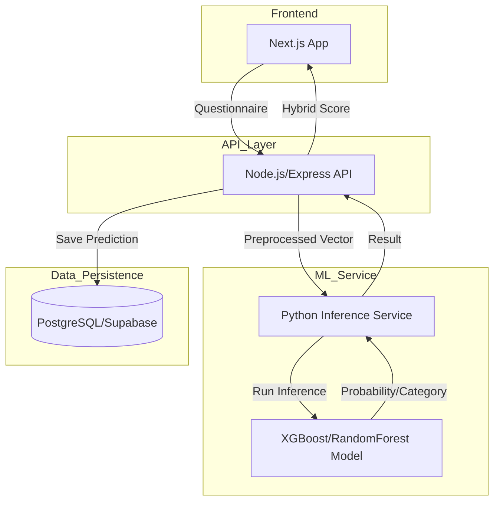

# AltCred ML Integration Plan

This document outlines the roadmap for transitioning from a rule-based credit scoring system to a production-ready Machine Learning model.

## 1. ML Architecture
The system will adopt a hybrid approach, combining the deterministic rule-based logic with predictive ML insights.

**Architecture Diagram:**


## 2. Data Pipeline
The system uses a reproducible pipeline to ingest and prepare data for training.

- **Ingestion**: Raw data is downloaded from Kaggle (`parisrohan/credit-score-classification`) using `kagglehub`.
- **Cleaning**:
    - Removal of junk characters (e.g., underscores in numeric fields).
    - Handling of mixed data types and missing values (median imputation for numeric).
    - Dropping of non-predictive identifiers (ID, Customer_ID, etc.).
- **Feature Engineering**:
    - **Categorical Encoding**: Label encoding for fields like `Occupation` and `Credit_Mix`.
    - **Target Mapping**: Standardizing `Credit_Score` into numeric values (Poor: 0, Standard: 1, Good: 2).
    - **Scaling**: Standard scaling for all numeric features to ensure model convergence.
- **Storage**:
    - `data/raw/`: Original CSV as downloaded.
    - `data/processed/`: Final cleaned dataset ready for training.

## 3. Model Training Pipeline
The training pipeline evaluates several supervised learning algorithms to find the most accurate predictor for credit scores.

- **Models Evaluated**:
    - **Logistic Regression**: Baseline linear model (Accuracy: ~56%).
    - **XGBoost**: Gradient boosting ensemble (Accuracy: ~74%).
    - **Random Forest**: Bagging ensemble (Accuracy: ~78% - **Selected**).
- **Evaluation Strategy**:
    - Stratified 80/20 train/test split.
    - Metrics: Accuracy, Precision, Recall, F1-Score (Weighted).
- **Model Selection**: The Random Forest model was selected for its superior F1-score and ability to handle non-linear relationships in financial data.
- **Serialization**: The final model is saved as `ml/models/credit_model.pkl` using `joblib`.

## 4. Feature Importance
Analysis of the Random Forest model revealed the top predictors of creditworthiness:
1. `outstanding_debt`
2. `interest_rate`
3. `num_of_delayed_payment`
4. `annual_income`

See `ml/models/feature_importance.png` for the full breakdown.

## 5. ML Inference Service
The **Next.js/Express** backend communicates with a **FastAPI** inference service for real-time predictions.

- **Endpoint**: `POST /predict-credit-score`
- **Request Schema (Pydantic)**:
    - `age`, `annual_income`, `monthly_inhand_salary` (float)
    - `num_bank_accounts`, `num_credit_card` (int)
    - `interest_rate`, `num_of_delayed_payment` (float/int)
    - `outstanding_debt`, `credit_utilization_ratio` (float)
    - `total_emi_per_month`, `monthly_balance` (float)
    - Optional: `occupation`, `credit_mix`, `payment_of_min_amount`, `payment_behaviour` (string)
- **Response Format**:
    ```json
    {
      "credit_score_category": "Good",
      "confidence": 0.87,
      "probabilities": {
        "Poor": 0.05,
        "Standard": 0.08,
        "Good": 0.87
      }
    }
    ```
- **Backend Integration**:
    The Express backend will call this service when a user completes the financial questionnaire.

## 6. Database Schema: Prediction Logging
To monitor model performance and drift, every prediction will be logged.

### Table: `credit_predictions`
| Column | Type | Description |
|--------|------|-------------|
| `id` | UUID (PK) | Unique identifier |
| `user_id` | UUID (FK) | Reference to `users` |
| `features_json` | JSONB | The raw input features used for prediction |
| `prediction` | VARCHAR | Model output category |
| `probability` | FLOAT | Model confidence score |
| `model_version` | VARCHAR | ID of the model used |
| `created_at` | TIMESTAMP | Logging time |

## 9. Model Versioning & Registry
AltCred uses a versioned model management system located in `ml/models/` and `ml/registry/`.
- **Registry**: `ml/registry/model_registry.json` tracks metadata for all deployed models.
- **Dynamic Loading**: The FastAPI service reads the registry at startup to load the `active_model`. This allows for seamless A/B testing and rollbacks.

## 10. Feature Service
To ensure consistency between training environments and production, all preprocessing logic is centralized in `ml/inference/feature_service.py`.
- **Responsibilities**: Label encoding, feature scaling, and feature re-ordering.
- **Benefits**: Eliminates "training-serving skew" and simplifies the inference API code.

## 11. Explainable AI (SHAP)
Every prediction now includes a SHAP (SHapley Additive exPlanations) analysis.
- **Top Contributors**: The API returns the top 3 features that influenced the specific user's credit score.
- **Local Explanations**: Helps users understand *why* they received a certain score (e.g., "High outstanding debt decreased your score").

## 12. Monitoring & Analytics Dashboard
A dedicated dashboard at `/analytics` provides real-time visibility into the system performance.
- **Metrics Tracked**:
    - **Prediction Latency**: Average response time of the ML service.
    - **Risk Distribution**: Breakdown of Good vs. Poor risk categories.
    - **Model Accuracy**: Success rate and drift monitoring via `prediction_outcomes`.
    - **System Health**: Active model version and service availability.
