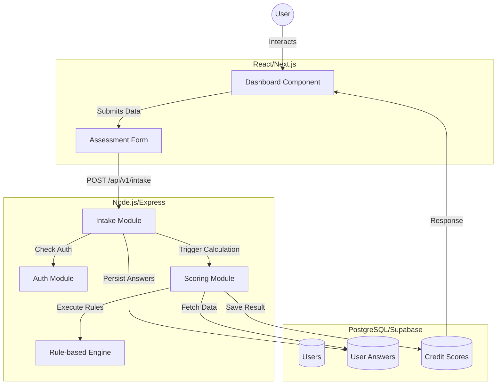
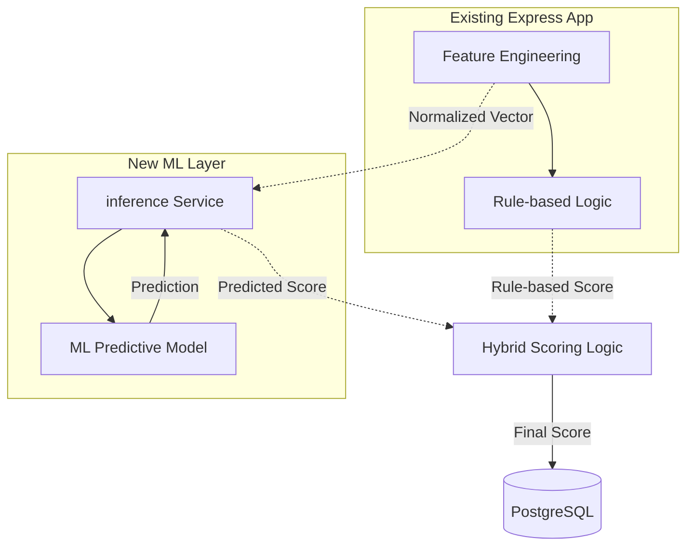

# AltCred System Architecture

## 1. System Overview
**AltCred** is an Alternative Credit Scoring application designed to provide creditworthiness assessments for users with limited traditional credit history. It uses alternative data points (employment stability, income patterns, savings buffer, etc.) to compute a normalized credit score (300-850).

## 2. Current Architecture
The existing system is built using a decoupled **Frontend-Backend-Database** architecture.

- **Frontend**: Built with **Next.js (React)**, utilizing Tailwind CSS for styling and Framer Motion for animations. It manages user interactions, assessment forms, and result visualization.
- **Backend**: A **Node.js/Express** modular monolith. It handles authentication, data ingestion, and the rule-based scoring logic.
- **Database**: **Supabase (PostgreSQL)** for persistent storage of user profiles, questionnaire answers, and calculated scores.
- **Scoring Logic**: A **Rule-based weighted factor model** implemented in JavaScript. It transforms categorical survey data into numerical features and applies predefined weights to calculate the final score.

### Infrastructure Diagram (Current)


## 3. Data Flow
1. **User Input**: The user completes a 10-point questionnaire on the React frontend.
2. **Data Submission**: Data is sent via a REST API (`/api/v1/intake/submit`) to the Express backend.
3. **Persistence**: The raw answers are stored in the `user_answers` table in PostgreSQL.
4. **Processing**: The `Credit Score Service` is triggered.
    - **Feature Engineering**: Maps categorical answers (e.g., "PG") to numerical values (0.0-1.0).
    - **Weighted Scoring**: Applies weights to different pillars (Payment History 35%, Financial Stability 25%, Income Factors 20%, Responsibility 20%).
5. **Storage**: The final score, category, and factor breakdown are saved in the `credit_scores` table.
6. **Response**: The dashboard fetches the latest score and displays it via color-coded risk categories.

## 4. Important Components
- **API Endpoints**: 
  - `POST /api/v1/auth/signup/login`: User management.
  - `POST /api/v1/intake/submit`: Questionnaire submission.
  - `GET /api/v1/credit-score/latest`: Result retrieval.
- **Scoring Logic**: Located in `backend/src/modules/credit-score/services/`.
- **Database Tables**: `users`, `user_answers`, `credit_scores`.
- **Frontend Forms**: Managed by `QuestionCard` component in `frontend/src/components/`.

## 5. Planned ML Integration Point
The ML model should be inserted between the **Feature Engineering** phase and the **Scoring Result** phase. Instead of relying solely on the `Weighted Sum` logic in `mlModel.service.js`, the system will call a predictive model.

### Future Architecture Diagram


> [!TIP]
> **Integration Strategy**: The ML model can be exposed via a lightweight Flask API or integrated directly using ONNX/TensorFlow.js if performance is critical for local execution within Node.js.

## 6. Recommended Project Folder Structure
To support Phase 2 (ML Integration), the following structure is proposed:

```text
AltCred/
├── backend/            # Express.js Source
├── frontend/           # Next.js Source
├── ml/                 # NEW: ML Model development
│   ├── models/         # Trained model binaries (e.g., .pkl, .onnx)
│   ├── src/            # Training scripts (Python/Scikit-learn/XGBoost)
│   └── pipeline/       # Data preprocessing pipelines
├── data/               # NEW: Training data
│   ├── raw/            # Anonymized historical datasets
│   └── processed/      # Cleaned data for training
├── notebooks/          # NEW: Jupyter Notebooks for EDA and training experiments
├── docs/               # System documentation
└── docker-compose.yml  # Container orchestration
```
